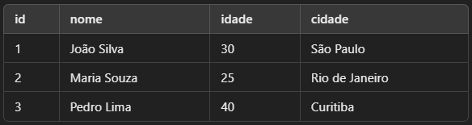

# Manipulação de Dados (DML - Data Manipulation Language)

Vamos começar a estudar a manipulação de dados em quarrys SQL para termos um profundo entendimento sobre seus usos, limitações e serviços. O DML é um subconjunto de instruções do próprio SQL. contido no DML nós temos, SELECT, INSERT, UPDATE, DELETE.

## SELECT - Consulta de Dados

O comando SELECT é a principal instrução do SQL para recuperar dados de um banco de dados. Ele permite visualizar informações armazenadas em tabelas, podendo ser combinado com filtros, ordenações e agregações para obter resultados específicos. Pode ser usado para:

- Buscar todos os clientes cadastrados no banco de dados.

- Listar os produtos com preços acima de R$ 100.

- Contar quantos pedidos foram feitos em um determinado período.

Agora vamos começar estudando a sintáxe básica de uma consulta de **SELECT**

``` SQL

SELECT colunas FROM tabela;

```

**Colunas:** Define quais colunas serão exibidas no resultado (0u * para todas).

**Tabela**: Nome da tabela de onde os dados serão buscados. como por exemplo:



---

### Usos do SELECT

``` SQL

-- Selecionar todas as colunas de uma tabela

SELECT * FROM clientes;


-- Selecionar colunas específicas

SELECT nome, idade FROM clientes;


-- Renomear colunas no Resultado (AS)

SELECT nome AS "Nome do Cliente", idade AS "Idade" FROM clientes;


-- Contar quantos registros existem (COUNT)

SELECT COUNT(*) AS total_clientes FROM clientes;

```

Resultados:


### Boas Práticas

- Especifique apenas as colunas necessárias (**SELECT nome, idade** ao invés de SELECT *).

- Use apelidos (**AS**) para tornar os resultados mais legíveis.

- Combine com filtros (**WHERE**) para evitar retornos desnecessários.

## INSERT - Inserção de Dados

O comando INSERT é utilizado para adicionar novos registros em uma tabela do banco de dados. Ele permite inserir valores manualmente ou a partir de outra consulta.

- Cadastrar um novo cliente em um sistema

- Adicionar um pedido na tabela de vendas

- Registrar um novo produto no estoque

Agora vamos entender sua Sintaxe básica

``` SQL

INSERT INTO tabela (coluna1, coluna2, ...) VALUES (valor1, valor2, ...);

```

**Tabela:** Nome da tabela onde os dados serão inseridos.

**coluna1, coluna2, ...:** As colunas onde os valores serão armazenados.

**valor1, valor2, ...:** Os valores que serão inseridos

### Usos do INSERT

``` SQL

-- Inserindo um único registro

INSERT INTO clientes (nome, idade, cidade)  
VALUES ('Carlos Mendes', 35, 'Belo Horizonte');


-- Inserindo vários registros de uma vez

INSERT INTO clientes (nome, idade, cidade)  
VALUES 
    ('Ana Pereira', 28, 'Porto Alegre'),  
    ('Ricardo Alves', 45, 'Salvador');


-- Inserindo um registro sem especificar todas as colunas

INSERT INTO clientes (nome, cidade)  
VALUES ('Fernanda Lima', 'Brasília');

```

### Boas Práticas

- Sempre listar as colunas explicitamente ao invés de **INSERT INTO clientes VALUES (...)**, para evitar erros caso a estrutura da tabela mude.

- Validar os dados antes da inserção para evitar valores inconsistentes.

- Usar transações **(BEGIN TRANSACTION)** quando precisar inserir vários registros e garantir consistência.

## UPDATE - Atualização de Dados

O comando UPDATE é utilizado para alterar os valores de registros existentes em uma tabela do banco de dados. Com ele, podemos modificar um ou mais campos de um conjunto específico de registros.

- Atualizar o endereço de um cliente.

- Corrigir a idade de um usuário.

- Alterar o status de um pedido.

Agora vamos ver a sua Sintaxe

``` SQL

UPDATE tabela SET coluna1 = valor1, coluna2 = valor2 WHERE condição;

```

**Tabela:** Nome da tabela onde os dados serão atualizados

**SET coluna1 = valor1, coluna2 = valor2:** Define quais colunas terão seus valores alterados.

**WHERE condição:** Define quais registros serão atualizados (evita modificar todos os dados da tabela).

### Usos do UPDATE

``` SQL

-- Atualizando um único registro

UPDATE clientes  
SET idade = 31  
WHERE id = 1;


-- Atualizando múltiplas colunas

UPDATE clientes  
SET idade = 26, cidade = 'Niterói'  
WHERE nome = 'Maria Souza';


-- Atualizando vários registros ao mesmo tempo

UPDATE clientes  
SET cidade = 'São Paulo'  
WHERE cidade = 'Niterói';

```

### Boas Práticas

- Sempre usar WHERE para evitar atualizar todos os registros da tabela.

- Verificar os dados antes da atualização para evitar alterações incorretas.

- Testar a consulta com um **SELECT** antes do **UPDATE** para garantir que os registros certos serão alterados.

## DELETE - Remoção de Dados

O comando DELETE é usado para remover registros de uma tabela do banco de dados. Ele permite excluir um ou mais registros com base em uma condição.

- Remover um cliente que cancelou sua conta.

- Excluir produtos que não estão mais no catálogo.

- Apagar pedidos cancelados de um sistema.

Sua sintáxe basica é

``` SQL

DELETE FROM tabela WHERE condição;

```

**tabela:** Nome da tabela onde os dados serão removidos

**WHERE condição:** Define quais registros serão excluídos, se não houver o **WHERE**, todos os registros serão excluídos!

### Uso do DELETE

``` SQL

-- Excluíndo um único registro

DELETE FROM clientes WHERE id = 2;


-- Excluindo vários registros ao mesmo tempo

DELETE FROM clientes WHERE cidade = 'curitiba';


-- Excluindo todos os registros

DELETE FROM clientes;

```

### Boas práticas

- Sempre usar **WHERE** para evitar excluir todos os dados por acidente.

- Criar backups antes de deletar registros importantes.

- Testar a consulta com **SELECT** antes de executar o **DELETE** para garantir que os registros certos serão removidos.
