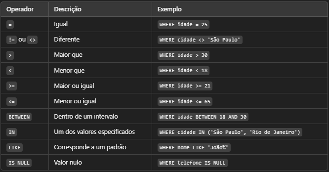

# Filtragem de Resultados com WHERE

A cláusula WHERE é usada para filtrar registros de uma tabela com base em uma condição específica.

Ela pode ser utilizada em comandos como SELECT, UPDATE e DELETE para selecionar apenas os dados desejados.

- Buscar clientes de uma cidade específica

- Atualizar a idade de um usuário com base no ID

- Excluir produtos que estão fora de estoque

Vamos ver a Sintáxe Básica do operador WHERE.

``` SQL

SELECT * FROM tabela WHERE condição;

```

Tabela: Nome da tabela onde os dados serão filtrados

Condição: Define quais registros serão retornados.

Vamos ver como o WHERE pode ser filtrado com base em operadores.



## Casos de Uso

``` SQL

-- Filtrando por um valor exato (=)

SELECT * FROM clientes WHERE cidade = 'são paulo';


-- Filtrando valores dentro de um intervalo (BETWEEN)

SELECT * FROM clientes WHERE idade BETWEEN 25 AND 35;


-- Filtrando múltiplos valores (IN)

SELECT * FROM clientes WHERE cidade IN ('são paulo', 'curitiba');


-- Buscando registros com um padrão

SELECT * FROM clientes WHERE nome LIKE 'J%';


-- Filtrando valores nulos (IS NULL)

SELECT * FROM clientes WHERE telefone IS NULL;

```

## Boas práticas

- Sempre utilizar WHERE em DELETE e UPDATE para evitar alterar todos os registros.

- Usar índices em colunas frequentemente filtradas para melhorar a performance.

- Evitar o uso excessivo de LIKE '%texto%', pois pode ser lento em grandes volumes de dados.
