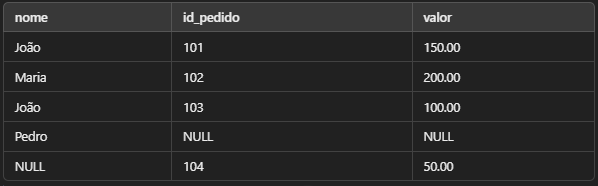
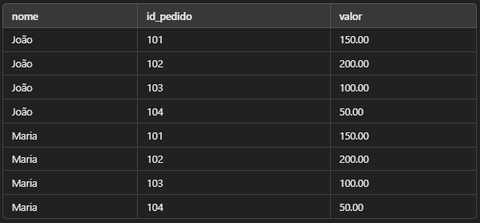

# Joins e Combinações de Dados

Os **JOINS** permitem combinar dados de duas ou mais tabelas baseando-se em uma relação comum entre elas. Isso é essencial porque os bancos de dados relacionais armazenam informações distribuídas entre várias tabelas para evitar redundância e melhorar a organização.

**INNET JOIN** -> Retorna apenas registros correspondente entre as tabelas.

**LEFT JOIN** -> Retorna todos os registros da tabela à esquerda, e os correspondentes da direita.

**RIGHT JOIN** -> Retorna todos os registros da tabela à direita, e os correspondentes da esquerda.

**FULL JOIN** -> Retorna todos os registros de ambas tabelas, com correspondências quando existem.

**CROSS JOIN** -> Retorna o produto cartesiano (todas as combinações possíveis).

## Criando um Cenário Prático

Suponha que temos duas tabelas:

Tabela de Clientes

| id_cliente | nome  | cidade         |
|------------|-------|----------------|
| 1          | João  | São Paulo      |
| 2          | Maria | Rio de Janeiro |
| 3          | Pedro | Belo Horizonte |

Tabela de pedidos

| id_pedido | id_cliente | valor      |
|-----------|-----------|-------------|
| 101       | 1         | 150.00      |
| 202       | 2         | 200.00      |
| 303       | 3         | 100.00      |
| 304       | 4         | 50.00       |

Agora, aplicamos os **JOINS** com base na relação clientes.id_cliente = pedidos.id_cliente.

## INNER JOIN - Junção Interna

O INNER JOIN retorna apenas os registros que têm correspondência em ambas as tabelas.

``` SQL

SELECT clientes.nome, pedidos.id_pedido, pedidos.valor FROM clientes INNER JOIN pedidos ON clientes.id_cliente = pedidos.id_cliente;

```

### Restultado


Note que o cliente "Pedro" não aparece, pois não tem pedidos.

## LEFT JOIN - Junção à Esquerda

O LEFT JOIN retorna todos os registros da tabela esquerda (clientes), mesmo que não haja correspondência na tabela direita (pedidos).

``` SQL

SELECT clientes.nome, pedidos.id_pedido, pedidos.valor
FROM clientes
LEFT JOIN pedidos ON clientes.id_cliente = pedidos.id_cliente;

```

### Restultado


Observe que "Pedro" foi incluído, mesmo sem pedidos (NULL nos campos da tabela pedidos).

## RIGHT JOIN - Junção à Direita

O RIGHT JOIN retorna todos os registros da tabela direita (pedidos), mesmo que não haja correspondência na tabela esquerda (clientes).

``` SQL

SELECT clientes.nome, pedidos.id_pedido, pedidos.valor
FROM clientes
RIGHT JOIN pedidos ON clientes.id_cliente = pedidos.id_cliente;

```


O pedido 104 foi incluído, mesmo que o cliente não exista na tabela clientes (NULL no campo nome).

## FULL JOIN - Junção Completa

O FULL JOIN retorna todos os registros de ambas as tabelas, com correspondências quando disponíveis.

``` SQL

SELECT clientes.nome, pedidos.id_pedido, pedidos.valor
FROM clientes
FULL JOIN pedidos ON clientes.id_cliente = pedidos.id_cliente;

```



Nem todos os bancos de dados suportam FULL JOIN. Em MySQL, use LEFT JOIN UNION RIGHT JOIN.

## CROSS JOIN - Produto Cartesiano

O CROSS JOIN combina todas as linhas da primeira tabela com todas as linhas da segunda tabela.

``` SQL

SELECT clientes.nome, pedidos.id_pedido, pedidos.valor
FROM clientes
CROSS JOIN pedidos;

```



Use com cuidado, pois pode gerar muitas linhas desnecessárias.

## Subqueries e EXISTS

As subqueries são consultas dentro de outras consultas. O operador EXISTS verifica se um determinado conjunto de dados existe.

``` SQL

-- Exemplo de Subquery

SELECT nome FROM clientes
WHERE id_cliente IN (SELECT id_cliente FROM pedidos);


-- Exemplo de EXISTS

SELECT nome FROM clientes
WHERE EXISTS (SELECT 1 FROM pedidos WHERE pedidos.id_cliente = clientes.id_cliente);

```

Ambos retornam clientes que fizeram pelo menos um pedido.