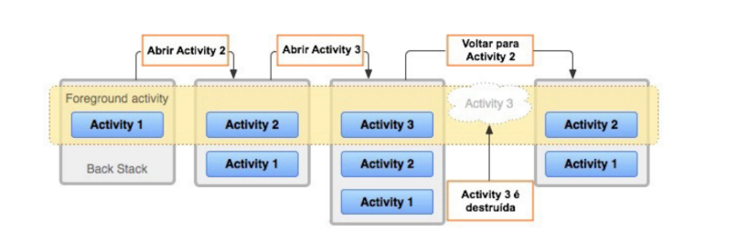
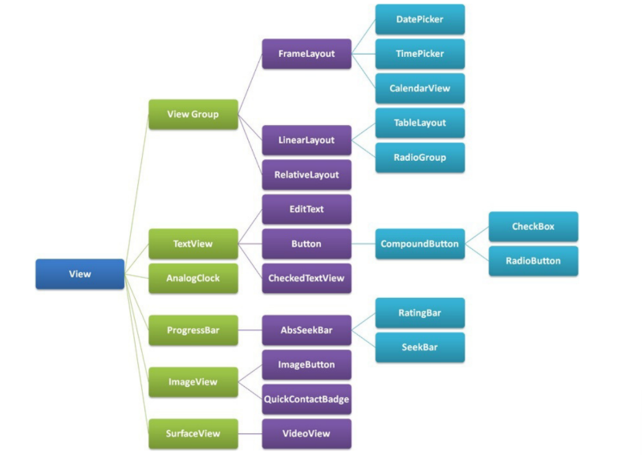

[Android SDK](#android-sdk)
[Estrutura de um Projeto Android](#estrutura-de-um-projeto-kotlin-android)
[Activities](#activities)
[Definindo o Conteúdo na Tela](#definindo-conteúdo-na-tela)
[Classe Resource](#classe-resource)
[Criação de Telas](#criação-de-telas)

# Android SDK

É um conjunto de ferramentas (SDK) oferecidas pela Android para poder auxiliar o desenvolvimento de aplicativos Android, dentro da Android SDK encontramos bibliotecas, ferramentas, documentação e emuladores essenciais para desenvolver. O Android SDK funciona como um intermediário entre o código do desenvolvedor (Java/Kotlin) e a API do Sistema Operacional Android.

Dentro do Android SDK encontramos:

- **SDK Platforms:** Bibliotecas necessárias para rodar o aplicativo em diferentes versões do Android, contem todas as APIs disponíveis para codificar em qualquer versão do android, atualmente até a API 35

- **SDK Tools:** Inclui ferramentas de depuração e desenvolvimento

- **Build-Tools:**  Inclui o compilador e ferramentas de build (como o Gradle), que transformam o código-fonte em um arquivo ***.apk*** ou ***.aab***.

Quando utilizamos IDEs como o Android Studio, já vem integrado a linguagem Kotlin e o Android SDK

## Conceitos Importantes

Dentro do desenvolvimento Android, encontramos termos como:

- **Android Package Kit (APK):** É um formato de arquivo que é usado para distribuir e instalar aplicativos no sistema operacional android. Esse formato, além do aplicativo, contem binários e bibliotecas para todas as arquiteturas de processador suportadas.

- **Android App Bundle (AAB):** Foi criado de forma oficial pela Google e tem como objetivo substituir o formato do APK tradicional, ele é mais otimizado, gerando APKs menores e personalizados para cada dispositivo na Google PLay Store.

A diferença entre eles, é que no **APK**, o aplicativo irá baixar todas as arquiteturas possíveis de processador para sempre conseguir rodar no processador respectivo, já o **Android App Bundle** analisa anteriormente o tipo de processador e remove as arquiteturas inrelevantes antes de baixar o APK.

---

# Estrutura de um Projeto Kotlin-Android

Para desenvolver projetos em dispositivos Android, precisamos entender como funciona a estrutura e organização de um projeto e como o código é estruturado nele. Vamos analisar a estrutura inicial de um projeto Kotlin:

``` bash

MeuApp/
│
├── app/
│   ├── src/
│   │   ├── main/
│   │   │   ├── java/ ou kotlin/
│   │   │   ├── res/
│   │   │   └── AndroidManifest.xml
│   │   │
│   │   ├── test/
│   │   └── androidTest/
│   │
│   ├── build.gradle (Module: app)
│
├── gradle/
├── build.gradle (Project)
├── settings.gradle
└── gradle.properties

```

- **app/:** É onde encontramos o projeto que será compilado e codificado pelo desenvolvedor, ele contém algumas pastas e arquivos padrões que analisaremos a seguir.
    - **Java/ ou Kotlin/:** É onde ficará o código que iremos montar, dentro dessas pastas iremos separar e organizar o código em pacotes (packages), é onde ficará o código-fonte.
    - **res/:** Aqui nessa pasta, é onde ficarão todos os arquivos de suporte ao código-fonte, como imagens, etc... Ele é ramificado em outros pacotes, sendo:
        - **layout/:** Aqui é onde irá ficar as páginas/telas, normalmente programadas em XML.
        - **drawable/:** Nessa pasta iremos manter as imagens e shapes que as telas irão usar.
        - **values/:** Aqui é onde mantemos as informações reutilizaveis pelas telas, sendo coisas como variáveis, textos padrões (Strings), cores e até temas.
        - **mipmap/:** Aqui irá ficar icones do sistema, recebendo um tratamento diferente das imagens devido a necessidade de portabilidade por telas diferentes.
    - **build.gradle (module):** Aqui nesse arquivo, encontramos uma configuração com o SDK, dependências utilizadas e versões do aplicativo.

- **global:** Nessa parte, encontramos 4 tipos de arquivos padrões necessários para o funcionamento de um projeto Android, sendo:
    - **build.gradle (Project):** Define configurações globais para os arquivos do projeto.
    - **settings.gradle:** Lista os módulos que o sistema irá utilizar
    - **gradle.properties:** Em geral, serve para uma configuração de performance e flags.

---

# Activities

Uma Activity dentro do Android é popularmente conhecida como uma tela, ou seja, um aplicativo pode possuir várias activities e necessariamente uma principal, que seria a ***MainActivity***, que é mostrada ao usuário quando ele inicia o aplicativo.

Uma activity normalmente possui botões, caixa de texto e seleção, tudo para oferecer alguma interação com o usuário do sistema.

Uma activity pode chamar outras activities, e a medida que o sistema vai chamando, elas possuem uma hierarquia de empilhamento, onde activity x chama y e activity y chama z, então temos uma hierarquia de:

X -> Y -> Z

E dessa forma o aplicativo android vai criando uma ***Pilha de Navegação***, e a medida que você vai apertando no botão de voltar do celular, as activities vão sendo desempilhadas uma a uma.



Uma activity sempre ficará presente dentro do pacote principal do projeto, sendo:

src > main > java > com.example.meuprojeto

## Como Criar uma Activity

Para criar uma activity, utilizamos o sistema de herança, onde criamos uma classe que representa uma activity e ela irá herdar de ***Activity()*** que é uma classe provinda da API Android.

Agora teremos uma classe que representa uma Activity e o Android já irá entender ela como uma.

``` Kotlin

import android.app.Activity         // Importação da Activity provinda da API Android

class MainActivity : Activity(){    // Declaração de herança de uma activity

}

```

Agora temos uma classe Activity básica, a medida que formos dando funcionalidades para a Activity, as funções serão implementadas no código.

## Tipos de Herança de Activity

Dentro do SDK Android, podemos encontrar diferentes casses herdadas, que definem comportamento e compatibilidade, entre elas, podemos encontrar:

**AppCompactActivity:** É a classe mais comum de ser herdada para montar uma activity, ela faz parte da biblioteca ***JetPack AppCompact*** (classe nativa) e ela permite retrocompatibilidade, permitindo uso de recursos mais novos do android em versões mais antigas do sistema.

**ComponentActivity:** É uma classe mais leve e moderna em relação a AppCompactActivity e serve como base de herança da AppCompactActivity (AppCompactActivity : ComponentActivity), e é utilizada quando você não precisa de todos os recursos que a AppCompactActivity proporciona, servindo como abordagem mais enxuta. É muito utilizada no Jatpack Compose.

**Activity:** Essa é a classes pai fundamental de uma activity no android, onde todas as outras heram dela. usada quando precisa de controle total e mínimo de recursos adicionais. É raramente utilizada hoje em dia.

**FragmentActivity:** É uma subclasse de Activity, que adiciona suporte para lidar com fragmentos (Fragments) em versões mais antigas do Android.

---

## LifeCicle Activities

A medida que o usuário navega pelo sistema, as activities vão sofrendo ações também, e as ações básicas das activities compoem o Lifecicle delas.

Os métodos que fazem parte do lifecicle são:

| Método              | Quando é chamado                                      | Finalidade principal                                      |
|---------------------|-------------------------------------------------------|-----------------------------------------------------------|
| onCreate()          | Ao criar a Activity                                   | Inicialização geral (layout, variáveis, estado inicial)   |
| onStart()           | Quando a Activity se torna visível                    | Preparar UI para o usuário                                |
| onResume()          | Quando a Activity entra em primeiro plano             | Interação com o usuário começa                            |
| onPause()           | Quando outra Activity entra parcialmente em foco      | Pausar tarefas leves (ex: animações, sensores)            |
| onStop()            | Quando a Activity não está mais visível               | Liberar recursos pesados                                  |
| onRestart()         | Quando a Activity volta após ter sido parada          | Preparar retorno ao fluxo                                 |
| onDestroy()         | Antes da Activity ser destruída                       | Limpeza final de recursos                                 |


## Variável SavedInstanceState

É uma variável que é utilizada pelo Oncrate, ela serve para recuperar um estado anterior do aplicativo, caso ele tenha sido pausado ou encerrado, dessa forma, o Android pode armazenar o estado anterior e recriar ele quando necessário. Ele é normalmente utilizado como parâmetro do método onCreate().

``` 

class MainActivity : Activity() {

    override fun onCreate(savedInstanceState: Bundle?) {
        super.onCreate(savedInstanceState)
        setContentView(R.layout.activity_main)

        val texto = savedInstanceState?.getString("chave")
        println("Restaurado: $texto")
    }
}

```

---

# AndroidManifest

Todo aplicativo android precisa ter esse arquivo .xml dentro da main do projeto e ele servirá para informar ao android, algumas informações relevantes sobre o aplicativo, como quais activities ele possui, qual o nome do pacote e as permissões necessárias para usar o App.

``` xml

<?xml version="1.0" encoding="utf-8"?>
<manifest xmlns:android="http://schemas.android.com/apk/res/android"
    xmlns:tools="http://schemas.android.com/tools">

    <application
        android:allowBackup="true"
        android:dataExtractionRules="@xml/data_extraction_rules"
        android:fullBackupContent="@xml/backup_rules"
        android:icon="@mipmap/ic_launcher"
        android:label="@string/app_name"
        android:roundIcon="@mipmap/ic_launcher_round"
        android:supportsRtl="true"
        android:theme="@style/Theme.CalculoAposentadoria">
        <activity android:name=".MainActivity">
            <intent-filter>
                <action android:name="android.intent.action.MAIN"/>             <!--Define que essa será a activity principal do projeto -->
                <category android:name="android.intent.category.LAUNCHER"/>     <!--Define que o software será executado por essa tela-->
            </intent-filter>
        </activity>
    </application>

</manifest>

```

Algumas tags importantes são:

- manifest: É a principal tag que contém o pacote do código e o nome do XML
- application: É uma tag que contem as informações relevantes que irão rodar no ambiente, como o ícone utilizado, o tema que será carregado, etc...
- uses-permission: Essa é uma tag que realiza a solicitação de acesso para que o android permita o aplicativo fazer uso de ferramentas como Camera ou a Internet.
- activity: Declarar uma activity que o sistema irá renderizar.
- intent-filter: É uma tag que permite o Android entender quais são as intenções da tela, isso permite o SO realizar ações ou solitações ao aplicativo, já sabendo o que ele faz.
- uses-sdk: Define o SDK mínimo e máimo para que o sistema rode com compatibilidade.

---

# Definindo conteúdo na tela

Quando criamos uma Activity, uma etapa do seu ciclo de vida é o OnStart() e esse método é justamente a parte que se refere a criação gráfica do conteúdo que aparece na tela do usuário.

O conteúdo pode ser mostrado pela função ***setContentView(texto)***, esse método irá imprimir na tela da activity o conteúdo expresso dentro do parâmetro, iremos usar eles nas duas formas de desenvolver uma tela.

Há duas formas de mostrar o conteúdo do aplicativo na tela, a primeira se refere a criação de uma estrutura visual diretamente no código fonte, utilizando métodos da API Android, porém não retorna muitas vantagens, pois o código se torna maior, complexo e misturado com a lógica.

``` kotlin

import android.app.Activity
import android.os.Bundle
import android.widget.TextView
class MainActivity : Activity() {
    override fun onCreate(savedInstanceState: Bundle?) {
        super.onCreate(savedInstanceState)

        val texto = TextView(this)          //Criando um objeto de texto
        texto.text = "Hello Kotlin"

        setContentView( texto )             //definindo o conteúdo da tela
    }
}

```

A segunda opção é a criação de telas separadas dentro de um arquivo XML, que ficará localizado na pasta res/layout, com isso, podemos referenciar o arquivo de layout para a função setContentView() e aqui poderemos expor uma página inteira na tela.

``` xml

// Nome do arquivo activity_main.xml

<?xml version="1.0" encoding="utf-8"?>
<TextView xmlns:android="http://schemas.android.com/apk/res/android"
    android:layout_width="match_parent"
    android:layout_height="match_parent"
    android:text="Hello Kotlin" />

```

``` kotlin

import android.app.Activity
import android.os.Bundle

class MainActivity : Activity() {
    override fun onCreate(savedInstanceState: Bundle?) {
        super.onCreate(savedInstanceState)
        
        setContentView( R.layout.activity_main )     //definindo o conteúdo da tela
    }
}

```

---

# FindViewById

Essa função nos permite resgatar o componente View dentro da tela, preservando seu estado, funciona como um FindById do JS.

``` XML

<Button
android:layout_width="wrap_content"
android:layout_height="wrap_content"
android:text="login"
android:id="@+id/btn_login" />

```

``` kotlin

import android.widget.Button
...
val button = findViewById<Button>(R.id.btn_login)        // Usamos a classe R para resgatar os valores da Activity.

```

- O método findViewById() pode resgatar qualquer componente View da tela, então para isso, é necessário especificar de qual objeto genérico estamos recuperando o tipo.

---

# Classe Resource

A API do Android disponibiliza uma classe chamada R, essa classe é a abreviação de Resource, ela serve exatamente para resgatar informações de dentro do package resource, e com isso utilizamos os termos como R.drawable.background ou R.color.azul (resgatar variáveis de cor).

---

# Criação de Telas

Dentro de um aplicativo Android, podemos ter diferentes formas de criar uma tela, podemos utilizar 3 meios diferentes, sendo a criação de tela por meio de ***XML*** (Legado), por meio manual da ***classe View*** e utilizando o ***JetPack Compose*** (meio moderno). 

## Classe View

A classe View é uma classe extremamente importante para manipular elementos, com ela podemos criar e modificar elementos como botões, input, textos, etc... dentro da tela do Android.

Dentro dessa classe, há uma hierarquia definida entre os componentes, segue abaixo essa hierarquia:



### TextView

Essa classe define qualquer texto que será impresso na tela, podemos chamar ela através da tag ***TextView*** e usar sua propriedade ***text*** para informar o texto

``` xml

<TextView
android:layout_width="wrap_content"
android:layout_height="wrap_content"
android:text="Text exemplo" />

```

### EditText

Essa tag representa um input, podemos atribuir um texto informativo através da tag ***text*** também.

Outra propriedade importante dessa tag é a ***hint*** que serve como placeholder do campo de texto.

``` xml

<EditText
android:layout_width="match_parent"
android:layout_height="wrap_content"
android:hint="Nome de usuário" />

```

### Button

Essa tag cria um botão na tela que pode ser usado para disparar alguma ação.

Ele também possui a propriedade ***text***

``` xml

<Button
android:layout_width="wrap_content"
android:layout_height="wrap_content"
android:text="cadastrar" />

```

Um Button possui alguns métodos que podemos chamar dentro do código Kotlin, o SDK do Android disponibiliza uma função chamada ***setOnClickListener***, onde podemos executar algum comando dentro das chaves que será realizado sempre que o botão for clicado.

``` kotlin

btn_calcular.setOnClickListener {
    //aqui vai o código que será executado quando houver um click
do botão
}

```

### LinearLayout

Essa tag funciona como estrutura, não como componente, nela podemos definir o layout de como os dados serão mostrados. Ela possui 2 variantes, sendo a orientação vertical e a orientação horizontal.

``` xml

<LinearLayout
xmlns:android="http://schemas.android.com/apk/res/android"
android:layout_width="wrap_content"
android:layout_height="wrap_content"
android:orientation="vertical">         <!--Define que ficará um botão abaixo do outro -->

    <Button
    android:layout_width="wrap_content"
    android:layout_height="wrap_content"
    android:text="Botão 1" />
    <Button
    android:layout_width="wrap_content"
    android:layout_height="wrap_content"
    android:text="Botão 2" />
</LinearLayout>

```

### ListView

Esse componente permite o programador criar uma lista de informações que será exibida na tela, a lista pode conter valores default, como String ou até mesmo personalizar ela com a inserção de informações como imagem, formatação, etc...

### Altura e Largura

Dentro de uma View (qualquer componente), é necessário informar a altura e a largura do componente, caso o contrário, o código não irá compilar.

Podemos definir essas informações de 3 maneiras diferentes, sendo:

- **dp:** Funciona como o px, ela irá definir uma quantidade x de pixels independentes de densidade, ou seja, vai ser o valor de tamanho, não importa qual a resolução.

- **wrap_content:** Essa define que o valor será variável de acordo com o tamanho do dispositivo que estará rodando o programa, não distorcendo o aplicativo.

- **match_parent:** Essa irá definir que a View irá ocupar 100% do espaço que está alocada.

## Jetpack Compose

# Adapter

Um adapter é um componente responsável por converter individualmente cada item para uma lista de View Objects que serão mostrados na tela.

## ArrayAdapter

É uma lista presente dentro do Android SDK que podemos utilizar para fornecer dados para uma ***AdapterView***, que seria uma superclasse de Spinner, Gallery, ListView e GridView.

Essa classe possui os mesmos métodos que uma classe normal e pode armazenar qualquer tipo de valor, como um array genérico.

Com ela podemos recuperar dados estáticos provindos de um XML ou até de um banco de dados e fornecer como opções para o **AdapterView**.

O arrayAdapter possui métodos similares aos de uma lista para realizar seu gerenciamento, como add(), get(), etc...