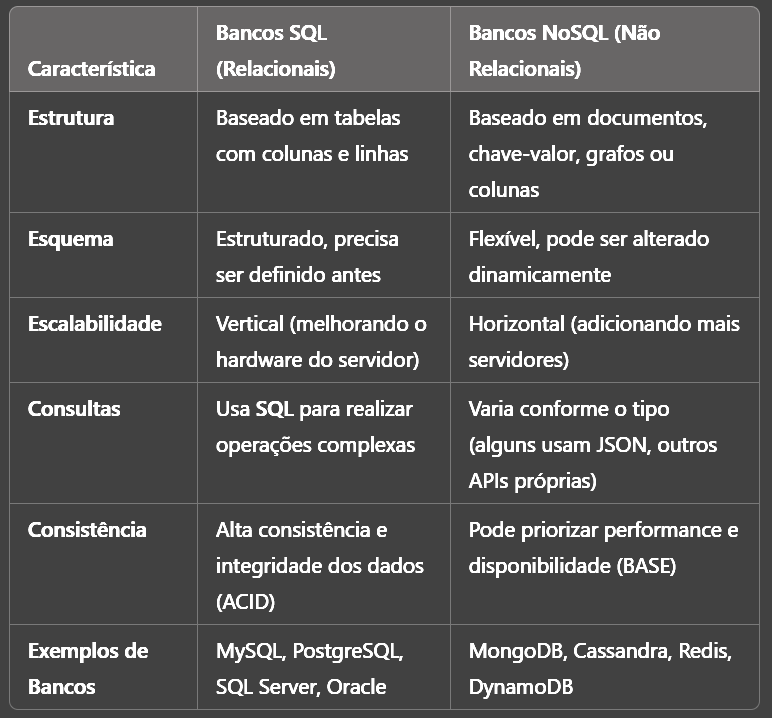

# Fundamentos do SQL

SQL é uma habilidade essencial para lidar com bancos de dados de forma eficiente.

## O que é SQL e para que serve?

SQL (Structured Query Language) é uma linguagem de programação usada para gerenciar e manipular bancos de dados relacionais. Ela permite criar, ler, atualizar e excluir dados (CRUD), além de realizar consultas complexas para análise e geração de relatórios. Usamos SQL para:

- Consultar e filtrar dados de forma eficiente

- Criar e modificar estruturas de bancos de dados

- Gerenciar permissões e segurança de acesso

- Integrar sistemas que precisam armazenar e recuperar informações estruturadas.

---

Os principais termos e conceitos que você deve conhecer para começar a estudar SQL são: 

**Banco de Dados Relacional:** Estrutura que armazena dados organizados em tabelas interconectadas.

**Tabelas:** Conjuntos de dados organizados em colunas e linhas

**Colunas(atributos):** Representam os tipos de dados armazenados (ex: nome, idade)

**Linhas(Registros):** Cada entrada na tabela ou dados de uma coluna representa um registro.

**Chave Primária:** Identificador único para cada registro na tabela.

**Chave Estrangeira:** Relaciona dados entre tabelas diferentes.

**DDL (Data Definition Language):** Comandos para definir e modificar estrutura do banco(**CREATE**, **ALTER**, **DROP**).

**DML (Data Manipulation Language):** Comandos para manipular dados (**INSERT**, **UPDATE**, **DELETE**, **SELECT**)

**DCL(Data Control Language):** Gerenciamento de permissões(**GRANT**, **REVOKE**).

**TCL(Transaction Control Language):** Controle de transações(**COMMIT**, **ROLLBACK**)

## Exemplos

Aqui estão alguns exemplos básicos em SQL usando MySQL/PostgreSQL:

``` SQL

-- Criando uma tabela

CREATE TABLE usuarios (
    id SERIAL PRIMARY KEY,
    nom VARCHAR (100) NOT NULL,
    email VARCHAR (100) UNIQUE NOT NULL,
    idade INT
);

-- Inserindo dados

INSERT INTO usuarios (nome, email, idade) VALUES
('Alice', 'alice@gmail.com', 25),
('Bob', 'bob@gmail.com', 30);

-- Consultando dados

SELECT * FROM usuarios;

-- Filtrando Registros

SELECT nome, email FROM usuarios WHERE idade > 25

-- Atualizando Registros

UPDATE usuarios SET idade = 31 WHERE nome = 'Bob';

-- Removendo registros

DELETE FROM usuarios WHERE nome = 'Alice';

```

Boa práticas

- Sempre defina chaves primárias e estrangeiras para manter a integridade dos dados.

- Use **VARCHAR** com tamanho adequado para otimizar armazenamento.

- Utilize índices (**INDEX**) para melhorar a performance de consultas em colunas muito pesquisadas.

- Utilize transações (**BEGIN TRANSACTION**, **COMMIT**, **ROLLBACK**) ao modificar dados importantes.

- Não use SELECT * em consultas grandes, prefira selecionar apenas as colunas necessárias.

- Cuidado ao usar DELETE sem WHERE, pois pode apagar todas as tabelas

- Evite redundância de dados e mantenha a normalização do banco.

# Diferença entre SQL e NoSQL

SQL e NoSQL são dois modelos de bancos de dados usados para armazenar e gerenciar informações, mas com abordagens diferentes:

- SQL (Bancos Relacionais): usa tabelas estruturadas, com esquemas rígidos e relacionamentos bem definidos.

- NoSQL (Bancos não Relacionais): é mais flexível, permitindo armazenar dados de maneira menos estruturada, sem a necessidade de esquemas fixos.

