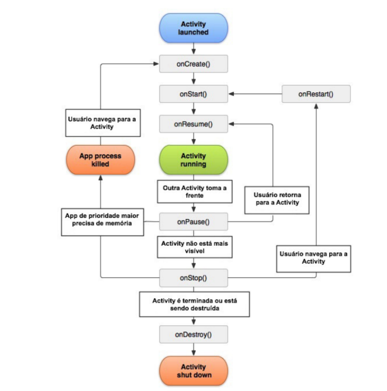

# Sumário 

[História do Kotlin](#história-do-kotlin)
[Função Main](#código-main)
[Variáveis](#variáveis)
[Tipo de Variáveis](#tipo-de-variáveis)
[Conversão de Tipos](#conversão-de-tipos)
[Template String](#template-string)
[Listas e Arrays](#listas-e-arrays)
[Importações](#importações)
[Estrutura de Repetição e Condição](#estrutura-de-condição-e-repetição)
[Comparativo](#comparativos)
[Funções](#funções)
[Herança](#herança)
[Data Class](#data-class)

---

# História do Kotlin

É uma linguagem de programação ***Open-Search*** criada pela JetBrains (criadora do InteliJ e do Android Studio) em 2010 e teve sua primeira versão após 6 anos de desenvolvimento, lançada em Fevereiro de 2016, agora ela possui além dos desenvolvimentos feitos pela JetBrains, um suporte gigante feito por uma unida comunidade do GitHUb.

O Kotlin é uma linguagem com ***interoperabilidade*** com o Java, isso permite que ambas as linguagens consigam se comunicar uma com a outra e até chamar trechos de códigos entre elas. O Kotlin é feito para ***POO*** e para ***Funcional***.

- ***Fortemente Tipada:*** Ela é tipada de forma manual, usando explicitamente o tipo que quer montar e também de forma dinâmica, onde apenas define-se o valor da variável e a variável irá ser tipada de acordo com o valor.

``` kotlin 

// Código Tipado Explicitamente
val nome: String = "DevMasterTeam"
val idade: Int = 18
val profissao: String = "Professor"

// Código Tipado Dinamicamente
val nome = "DevMasterTeam"
val idade = 27
val excelenteEnsino = true

```

- ***Concisa:*** Ela possui menos código Boilerplate do que o Java, permitindo uma estruturação de classes de forma mais rápida e menos trabalhosa

``` kotlin

// Aqui inclui-se propriedades e get/set
class Pessoa (var nome: String, var anoNascimento: Int)

```

- ***Segura:*** Kotlin trabalha com a abordagem de Null-Safe, para impedir que variáveis recebam um valor null, isso auxilia o código a não cometer o famoso NullPointerException. Pode-se apenas atribuir um valor null para uma variável se ela for marcada como ***Anulável*** através do símbolo ***?***

``` kotlin

// Não compila, pois uma String não pode receber Null
var nome: String = null

// Agora permite que um valor possa receber Null
var valor: String? = null

```

---

# Código MAIN

No Kotlin, todo código executa dentro de uma função main, essa função é definida através da seguinte nomeclatura:

``` kotlin

fun main(args Array<String>) {
    print("Meu primeiro programa);
}

```

---

# Variáveis

Para definir variáveis em Kotlin, há algumas maneiras diferentes, como o **var**, que permite criar variáveis mutaveis e o **val** que cria variáveis imutáveis, comos e fossem final. Vamos estudar a seguir, primeiramente abordando o conceito de var.

**Var:** Esse método permite criar variáveis que podem sofrer uma revalorização durante o fluxo de funcionamento do aplicativo, podemos definir uma variável de duas formas diferentes, atribuindo ou não um **tipo inferido**.

``` Kotlin

// Aqui definimos uma variável nome do tipo String
var nome: String = "Eduardo";

// Aqui podemos atribuir uma variável nome que dinamicamente sofre um tipo, isso se chama Inferência de Tipo
var nome = "Eduardo";

```

**Val:** O uso da variável val, permite criar variáveis que não podem mudar a referência, ou seja, criamos variáveis **final** que serão contínuas no programa, como a criação de uma variável para se referir a idade ou a PI, etc...

Essa variável ela fixa apenas a referência de memória, ou seja, para tipos primitivos, não é possível alterar seus valores, uma vez definidos, serão sempre aqueles.

Mas como o val armazena a referência de memória, uma variável pode apontar para um Objeto também, e nesse caso, ao apontar para um objeto em memória, a variável irá conter e fixar a referência de memória, permitindo alterar as propriedades do objeto, mas não a reatribuição para outro objeto.

``` kotlin

val lista = mutableListOf(1, 2);

lista = mutableListOf(3, 4); // Isso não é permitido

lista.add(3) // Isso é permitido

```

## Tipo de variáveis

No Kotlin, possuimos algumas variáveis bem similares ao Java, vamos estudar elas abaixo:

| Tipo        | Descrição                              | Exemplo                            |
|-------------|----------------------------------------|------------------------------------|
| Int         | Número inteiro                         | val x: Int = 10                    |
| Double      | Número decimal (precisão dupla)        | val pi = 3.14                      |
| Float       | Decimal com menor precisão             | val f = 3.14f                      |
| Long        | Inteiro grande                         | val l = 100000L                    |
| Short       | Inteiro pequeno                        | val s: Short = 10                  |
| Byte        | Inteiro muito pequeno                  | val b: Byte = 1                    |
| Boolean     | Verdadeiro ou falso                    | val ativo = true                   |
| Char        | Um único caractere                     | val letra = 'A'                    |
| String      | Cadeia de caracteres                   | val nome = "Kotlin"                |
| Array       | Coleção de elementos                   | val arr = arrayOf(1,2,3)           |
| List        | Lista imutável                         | val lista = listOf(1,2,3)          |
| MutableList | Lista mutável                          | val lista = mutableListOf(1,2,3)   | 
| Set         | Conjunto sem elementos duplicados      | val set = setOf(1,2)               |
| Map         | Estrutura chave-valor                  | val map = mapOf("a" to 1)          |

Além disso, vamos definir uma tabela que consta os difernetes tipos de definições de variáveis

| Categoria        | Tipo / Palavra-chave   | Descrição                                                                    | Exemplo                     |
|------------------|------------------------|------------------------------------------------------------------------------|-----------------------------|
| Mutável          | var                    | Pode ter seu valor alterado após a declaração                                | var idade = 20              |
| Imutável         | val                    | Não pode ser reatribuída após a inicialização                                | val nome = "Eduardo"        |
| Inferida         | (sem tipo explícito)   | O compilador deduz o tipo automaticamente                                    | val x = 10                  |
| Explícita        | : Tipo                 | Tipo declarado manualmente                                                   | val x: Int = 10             |
| Nullable         | ?                      | Pode armazenar valor nulo                                                    | var nome: String? = null    |
| Não-null         | (padrão)               | Não aceita valor nulo                                                        | var nome: String = "Ana"    |

O Kotlin possui uma peculiaridade interessante, no ponto de vista funcional da linguagem, o kotlin não possui **tipo primitivo**, pois ele trata todos os tipos de variáveis como objetos, ou seja, tanto int, double, float ou long possui métodos atribuidos a eles, e isso permite que possamos trabalhar com os tipos de forma mais flexível.

Mas uma nuância muito importante, esses tipos que o Java consideram primitivos e o Kotlin trabalha como objetos, são convertidos em tipos primitivos durante o processo de compilação.

Como resumo, podemos comparar o tipo Int do Kotlin com o tipo Integer do Java (wapper class), sabendo que ambos os tipos possuem um tipo int primitivo em sua essência.

## Conversão de Tipos

Como o Kotlin trabalha os tipos como Wapper Class, ele disponibiliza diversos métodos para trabalharmos, e isso inclui métodos de conversão, podemos utilizar métodos como toString(), toDouble(), toFloat(), etc... atrelados a cada tipo da linguagem.

```kotlin

var w: Int = 10;
var x: Double = w.toDouble();
var y: Float = x.toFloat();
var z: String = y.toString();

```

O tipo Booleano no Kotlin também recebe métodos, e podemos utilizar esses métodos para fazer verificação de tabela verdade através dos métodos.

``` kotlin 

val c1 = b1.and(b2) //Retorno será false
val c2 = b1.or(b2) //Retorno será true
val c3 = b1.not() //Retorno será false

```

---

# Template String

O Kotlin possui uma caracteristica muito interessante, ele possui uma coisa chamada de **Template String**, e isso de forma nativa na linguagem, permitindo a interpolação de variáveis em textos String utilizando o caractere $ para representar a chamada de uma variável.

Muitas linguagens possuem essa caracteristica, mas infelizmente o java não é uma delas.

``` kotlin

val idade: Int = 22;
String minhaIdade = "Eu tenho $idade anos de idade";

```

Além do Template String, o Kotlin permite o uso de aspas triplas para representar textos de várias linhas e com formatação, muito similar ao Java nesse quesito.

``` kotlin

val text = """
    Exemplo de texto
    com mais de uma
    linha
    """;

```

---

# Listas e Arrays

Um array em Koltin é definido da seguinte forma:

``` kotlin

val arrayInt: Array<Int> = arrayOf(1, 2, 3, 4);

val x = arrayInt[1] // recupera o número 2;

```

Como os arrays possuem valores definidos previamente e não permitem inserção dinâmica, podemos utilizar então um List para realizar uma estrutura que permita esse comportamento, porém, aqui temos uma diferença definida entre o Kotlin e o Java, pois as Listas são definidas de forma diferente.

``` kotlin

// Criação de uma lista Imutável, não permite inserção
var myImutableList: List<Int> = listOf(1, 2, 3, 4, 5);

var myMutableList: List<Int> = mutableListOf(1, 2, 3, 4, 5);

```

Vamos ver também alguns métodos que um tipo List possui, sendo que alguns métodos são válidos apenas para o tipo MutableList:

``` kotlin

val myList: List<String> = motableList("Uma palavra", "Duas Palavras");
val palavraEx: String = "Três palavras";

myList.add(palavraEx);                                  // Adiciona 1 elemento na lista
myList.addAll("Quarto Palavras", "Cinco Palavras");     // Adiciona vários elementos na lista
myList.removeAt(1);                                     // Remove o elemento na posição definida                                    
myList.remove(palavraEx)                                // Remove o elemento por igualdade
myList.first();                                         // Recupera o 1º Item da lista
myList.last();                                          // Recupera o Ultimo Item da lista
myList.filter(regex);                                   // Retorna uma lista filtrada

// Mutabilidade por Referência

val listaMutavel: List<Int> = mutableListOf(1, 2, 3);   // Define uma lista Mutavel
fun retornaLista: List<Int> = listaMutavel;             // Cria uma função que retorna a lista Mutavel
val listaImutavel: List<Int> = retornaLista();          // Atribui a lista mutável para uma lista Imutável
listaMutavel.add(4);                                    // Irá salvar e as 2 listas receberam a alteração

```

---

# Importações

No Kotlin, podemos realizar importações para utilizar classes e arquivos diferentes dentro do nosso algorítmo, e para isso, devemos realizar um import similar ao Java.

No Kotlin, caso você precise realizar um import que possua o mesmo nome de uma classe que já existe no fluxo, você pode apelidar ela com um **as**.

``` kotlin

import vitrine.produto as product
import carrinho.produto 

```

- Como já existe um produto vindo de outro package, podemos realizar um apelido para o produto vindo de vitrine, isso é importante quando lidamos com pacotes externos e bibliotecas.

---

# Estrutura de Condição e Repetição

**If Ternário:** Em Kotlin, usamos o if ternário de uma forma escrita um pouco diferente do Java, pois em vez de utilizar caracteres como ? e : utilizamos if else

``` kotlin

val maior = if(a > b) a else b

```

**When:** Essa é uma estrutura com nome novo, mas ela serve realizmente para ser como o Switch em Java, apenas com outro nome:

``` Kotlin

when(x) {
    1 -> print("X é igual a 1");
    2 -> print("X é igual a 2");
    else -> {
        print("X é maior que 2");
    }
}

when(x) {
    1, 2 -> print("X é igual a 1 ou a 2");                      // Utiliza um OU, sendo um ou outro
    else -> {
        print("X possui outro valor");
    }
}

when(x) {
    1..10 -> print("X possui um valor entre 1 e 10");           // Verifica intervalo de caracteres
    else -> print("X não é um valor entre 1 e 10");
}

```

**for:** Assim como o java, podemos criar uma estrutura de repetição for, mas em Kotlin, a sintáxe da estrutura funciona um pouco diferente do que estamos acostumados a montar, pois ela é similar ao python.

``` kotlin

val lista = listOf(1, 2, 3, 4);

for(i in lista) {
    print("Item da lista número $i");
}

for((index, value) in lista.withIndex()) {                  // Aqui temos um for que consegue puxar a posição do valor dentro da lista, para isso temos que puxar também o index diretamente da lista
    println("Item $value está no index $index");
}

```

- While em Kotlin funciona muito parecido com o Java.

---

# Comparativos

Dentro do Kotlin, podemos usar o sinal de igual para 3 funções diferentes, sendo:

Atribuição (=): refere-se a dar/trocar um valor a uma variável.

Comparação Estrutural (==): Ele realiza uma comparação entre 2 variáveis de forma estrutural, ou seja, verifica se os valores são iguais, é basicamente a chamada para a função .equals() do Java.

Comparação Referencial (===): Aqui nós não realizamos uma comparação de conteúdo, mas sim uma comparação de referência. Ele verifica se duas variáveis apontam para a mesma célula de memória, ou seja, não basta ter valores iguais, precisam ser exatamente a mesma variável

- O comparativo estrutural do Kotlin não é igual ao Java, no Java, a comparação é realizada, fazendo comparação de **referência de memória para objetos** e comparação de **valor para primitivos**

---

# Funções

Funções em Kotlin são definidas a partir da sequência fun + nome da função + parâmetros + retorno + chaves.

``` kotlin

fun somar(num1: Int, num2: Int): Long {             // Função completa com parâmetros e retorno
    return num1 + num2;
}

fun imprimir(text: String) : Unit {                 // Função com retorno Unit declara um retorno vazio ou sem retorno (pode ser ocultado)
    print(text)
}

fun somar(num1 : Int, num2 : Int) = num1 + num2;    // Uma função Single-Expression Function

```

---

# Herança

A herança em Kotlin funciona de forma similar ao Java, porém a herança não é definida pela palavra extend e sim pelo sinal de :

``` kotlin

class pessoa {
    var nome: String;
    var idade: Int;

    fun saudacao(): Unit {
        print("Olá");
    }
}

class funcionario : pessoa {
    var matricula: Int;
    var salario: Double;
}

```

---

# Data Class

O Data Class é muito similar a uma classe do tipo Record em Java, muito útil para realizar DTOs ou entidades simples, onde podemos criar uma entidade que recebe parâmetros (sem métodos) e montar tudo com apenas uma linha de código, incluindo propriedades, get e set.

``` kotlin

data class Usuario(var nome: String, var email: String, var senha: String);

```

---

# Android SDK

É um conjunto de ferramentas (SDK) oferecidas pela Android para poder auxiliar o desenvolvimento de aplicativos Android, dentro da Android SDK encontramos bibliotecas, ferramentas, documentação e emuladores essenciais para desenvolver.

Dentro do Android SDK encontramos:

- SDK Platforms: Bibliotecas necessárias para rodar o aplicativo em diferentes versões do Android

- SDK Tools: Inclui ferramentas de depuração e desenvolvimento

- Build-Tools: Contem ferramentas para compilar código em um arquivo APK ou AAB.

Quando utilizamos IDEs como o Android Studio, já vem integrado a linguagem Kotlin e o Android SDK

---

# Estrutura de um Projeto Kotlin-Android

Para desenvolver projetos em dispositivos Android, precisamos entender como funciona a estrutura e organização de um projeto e como o código é estruturado nele. Vamos analisar a estrutura inicial de um projeto Kotlin:

``` bash

MeuApp/
│
├── app/
│   ├── src/
│   │   ├── main/
│   │   │   ├── java/ ou kotlin/
│   │   │   ├── res/
│   │   │   └── AndroidManifest.xml
│   │   │
│   │   ├── test/
│   │   └── androidTest/
│   │
│   ├── build.gradle (Module: app)
│
├── gradle/
├── build.gradle (Project)
├── settings.gradle
└── gradle.properties

```

- **app/:** É onde encontramos o projeto que será compilado e codificado pelo desenvolvedor, ele contém algumas pastas e arquivos padrões que analisaremos a seguir.
    - **Java/ ou Kotlin/:** É onde ficará o código que iremos montar, dentro dessas pastas iremos separar e organizar o código em pacotes (packages), é onde ficará o código-fonte.
    - **res/:** Aqui nessa pasta, é onde ficarão todos os arquivos de suporte ao código-fonte, como imagens, etc... Ele é ramificado em outros pacotes, sendo:
        - **layout/:** Aqui é onde irá ficar as páginas/telas, normalmente programadas em XML.
        - **drawable/:** Nessa pasta iremos manter as imagens e shapes que as telas irão usar.
        - **values/:** Aqui é onde mantemos as informações reutilizaveis pelas telas, sendo coisas como variáveis, textos padrões (Strings), cores e até temas.
        - **mipmap/:** Aqui irá ficar icones do sistema, recebendo um tratamento diferente das imagens devido a necessidade de portabilidade por telas diferentes.
    - **build.gradle (module):** Aqui nesse arquivo, encontramos uma configuração com o SDK, dependências utilizadas e versões do aplicativo.

- **global:** Nessa parte, encontramos 4 tipos de arquivos padrões necessários para o funcionamento de um projeto Android, sendo:
    - **build.gradle (Project):** Define configurações globais para os arquivos do projeto.
    - **settings.gradle:** Lista os módulos que o sistema irá utilizar
    - **gradle.properties:** Em geral, serve para uma configuração de performance e flags.

---

# Activities

Uma Activity dentro do Android é popularmente conhecida como uma tela, ou seja, um aplicativo pode possuir várias activities e necessariamente uma principal, que seria a MainActivity, que é mostrada ao usuário quando ele inicia o aplicativo.

Uma activity normalmente possui botões, caixa de texto e seleção, tudo para oferecer alguma interação com o usuário do sistema.

Uma activity pode chamar outras activities, e a medida que o sistema vai chamando, elas possuem uma hierarquia de empilhamento, onde activity x chama y e activity y chama z, então temos uma hierarquia de:

X -> Y -> Z

E dessa forma o aplicativo android vai criando uma ***Pilha de Navegação***, e a medida que você vai apertando no botão de voltar do celular, as activities vão sendo desempilhadas uma a uma.


## Como Criar uma Activity

Para criar uma activity, utilizamos o sistema de herança, onde criamos uma classe que representa uma activity e ela irá herdar de Activity() que é uma classe provinda da API Android.

Agora teremos uma classe que representa uma Activity e o Android já irá entender ela como uma.

``` Kotlin

import android.app.Activity         // Importação da Activity provinda da API Android

class MainActivity : Activity(){    // Declaração de herança de uma activity

}

```

Agora temos uma classe Activity básica, a medida que formos dando funcionalidades para a Activity, as funções serão implementadas no código.

## Métodos de Callback

Um CallBack é uma função passada como argumento para outra função, que será executada em resposta a um evento ou a um determinado tempo. Esse é o conceito de callback, podemos encontrar o uso dessa prática em várias linguagens de programação, como JS, Java, Kotlin, Angular, etc...

``` JavaScript

function processar(dado, callback) {
    callback(dado);
}

```

Normalmente um CallBack está diretamente relacionado aos métodos de ciclo de vida de uma aplicação, no Angular seriam os LifeCicle Hooks e no Android, temos os ciclos de vida de uma Activity.

---

## LifeCicle Activities

A medida que o usuário navega pelo sistema, as activities vão sofrendo ações também, e as ações básicas das activities compoem o Lifecicle delas.

Os métodos que fazem parte do lifecicle são:

| Método              | Quando é chamado                                      | Finalidade principal                                      |
|---------------------|-------------------------------------------------------|-----------------------------------------------------------|
| onCreate()          | Ao criar a Activity                                   | Inicialização geral (layout, variáveis, estado inicial)   |
| onStart()           | Quando a Activity se torna visível                    | Preparar UI para o usuário                                |
| onResume()          | Quando a Activity entra em primeiro plano             | Interação com o usuário começa                            |
| onPause()           | Quando outra Activity entra parcialmente em foco      | Pausar tarefas leves (ex: animações, sensores)            |
| onStop()            | Quando a Activity não está mais visível               | Liberar recursos pesados                                  |
| onRestart()         | Quando a Activity volta após ter sido parada          | Preparar retorno ao fluxo                                 |
| onDestroy()         | Antes da Activity ser destruída                       | Limpeza final de recursos                                 |



## Variável SavedInstanceState

É uma variável que é utilizada pelo Oncrate, ela serve para recuperar um estado anterior do aplicativo, caso ele tenha sido pausado ou encerrado, dessa forma, o Android pode armazenar o estado anterior e recriar ele quando necessário. Ele é normalmente utilizado como parâmetro do método onCreate().

``` 

class MainActivity : Activity() {

    override fun onCreate(savedInstanceState: Bundle?) {
        super.onCreate(savedInstanceState)
        setContentView(R.layout.activity_main)

        val texto = savedInstanceState?.getString("chave")
        println("Restaurado: $texto")
    }
}

```

---

# Definindo conteúdo na tela

Quando criamos uma Activity, uma etapa do seu ciclo de vida é o OnStart() e esse método é justamente a parte que se refere a criação gráfica do conteúdo que aparece na tela do usuário.

O conteúdo pode ser mostrado pela função ***setContentView(texto)***, esse método irá imprimir na tela da activity o conteúdo expresso dentro do parâmetro, iremos usar eles nas duas formas de desenvolver uma tela.

Há duas formas de mostrar o conteúdo do aplicativo na tela, a primeira se refere a criação de uma estrutura visual diretamente no código fonte, utilizando métodos da API Android, porém não retorna muitas vantagens, pois o código se torna maior, complexo e misturado com a lógica.

``` kotlin

import android.app.Activity
import android.os.Bundle
import android.widget.TextView
class MainActivity : Activity() {
    override fun onCreate(savedInstanceState: Bundle?) {
        super.onCreate(savedInstanceState)

        val texto = TextView(this)          //Criando um objeto de texto
        texto.text = "Hello Kotlin"

        setContentView( texto )             //definindo o conteúdo da tela
    }
}

```

A segunda opção é a criação de telas separadas dentro de um arquivo XML, que ficará localizado na pasta res/layout, com isso, podemos referenciar o arquivo de layout para a função setContentView() e aqui poderemos expor uma página inteira na tela.

``` xml

// Nome do arquivo activity_main.xml

<?xml version="1.0" encoding="utf-8"?>
<TextView xmlns:android="http://schemas.android.com/apk/res/android"
    android:layout_width="match_parent"
    android:layout_height="match_parent"
    android:text="Hello Kotlin" />

```

``` kotlin

import android.app.Activity
import android.os.Bundle

class MainActivity : Activity() {
    override fun onCreate(savedInstanceState: Bundle?) {
        super.onCreate(savedInstanceState)
        
        setContentView( R.layout.activity_main )     //definindo o conteúdo da tela
    }
}

```

# Classe Resource

A API do Android disponibiliza uma classe chamada R, essa classe é a abreviação de Resource, ela serve exatamente para resgatar informações de dentro do package resource, e com isso utilizamos os termos como R.drawable.background ou R.color.azul (resgatar variáveis de cor).

---

# Criação de Telas

Dentro de um aplicativo Android, podemos ter diferentes formas de criar uma tela, podemos utilizar 3 meios diferentes, sendo a criação de tela por meio de ***XML*** (Legado), por meio manual da ***classe View*** e utilizando o ***JetPack Compose*** (meio moderno). 

## Classe View

A classe View é uma classe extremamente importante para manipular elementos, com ela podemos criar e modificar elementos como botões, input, textos, etc... dentro da tela do Android.

Dentro dessa classe, há uma hierarquia definida entre os componentes, segue abaixo essa hierarquia:


### TextView

Essa classe define qualquer texto que será impresso na tela, podemos chamar ela através da tag ***TextView*** e usar sua propriedade ***text*** para informar o texto

``` xml

<TextView
android:layout_width="wrap_content"
android:layout_height="wrap_content"
android:text="Text exemplo" />

```

### EditText

Essa tag representa um input, podemos atribuir um texto informativo através da tag ***text*** também.

Outra propriedade importante dessa tag é a ***hint*** que serve como placeholder do campo de texto.

``` xml

<EditText
android:layout_width="match_parent"
android:layout_height="wrap_content"
android:hint="Nome de usuário" />

```

### Button

Essa tag cria um botão na tela que pode ser usado para disparar alguma ação.

Ele também possui a propriedade ***text***

``` xml

<Button
android:layout_width="wrap_content"
android:layout_height="wrap_content"
android:text="cadastrar" />

```

### LinearLayout

Essa tag funciona como estrutura, não como componente, nela podemos definir o layout de como os dados serão mostrados. Ela possui 2 variantes, sendo a orientação vertical e a orientação horizontal.

``` xml

<LinearLayout
xmlns:android="http://schemas.android.com/apk/res/android"
android:layout_width="wrap_content"
android:layout_height="wrap_content"
android:orientation="vertical">         <!--Define que ficará um botão abaixo do outro -->

    <Button
    android:layout_width="wrap_content"
    android:layout_height="wrap_content"
    android:text="Botão 1" />
    <Button
    android:layout_width="wrap_content"
    android:layout_height="wrap_content"
    android:text="Botão 2" />
</LinearLayout>

```

### Altura e Largura

Dentro de uma View (qualquer componente), é necessário informar a altura e a largura do componente, caso o contrário, o código não irá compilar.

Podemos definir essas informações de 3 maneiras diferentes, sendo:

- dp: Funciona como o px, ela irá definir uma quantidade x de pixels independentes de densidade, ou seja, vai ser o valor de tamanho, não importa qual a resolução.

- wrap_content: Essa define que o valor será variável de acordo com o tamanho do dispositivo que estará rodando o programa, não distorcendo o aplicativo.

- match_parent: Essa irá definir que a View irá ocupar 100% do espaço que está alocada.

### FindViewById

Essa função nos permite resgatar o componente View dentro da tela, preservando seu estado, funciona como um FindById do JS.

``` XML

<Button
android:layout_width="wrap_content"
android:layout_height="wrap_content"
android:text="login"
android:id="@+id/btn_login" />

```

``` kotlin

import android.widget.Button
...
val button = findViewById<Button>(R.id.btn_login)        // Usamos a classe R para resgatar os valores da Activity.

```

- O método findViewById() pode resgatar qualquer componente View da tela, então para isso, é necessário especificar de qual objeto genérico estamos recuperando o tipo.

## Jetpack Compose

