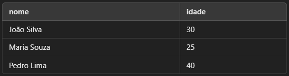

# Manipulação de Dados (DML - Data Manipulation Language)

Vamos começar a estudar a manipulação de dados em quarrys SQL para termos um profundo entendimento sobre seus usos, limitações e serviços.

## SELECT - Consulta de Dados

O comando SELECT é a principal instrução do SQL para recuperar dados de um banco de dados. Ele permite visualizar informações armazenadas em tabelas, podendo ser combinado com filtros, ordenações e agregações para obter resultados específicos. Pode ser usado para:

- Buscar todos os clientes cadastrados no banco de dados.

- Listar os produtos com preços acima de R$ 100.

- Contar quantos pedidos foram feitos em um determinado período.

### Conceitos Fundamentais

Vamos começar estudanod a sintáxe básica de uma consulta de **SELECT**

``` SQL

SELECT colunas FROM tabela;

```

- **Colunas:** Define quais colunas serão exibidas no resultado (0u * para todas).

- **Tabela**: Nome da tabela de onde os dados serão buscados. como por exemplo:


---

- Selecionar todas as colunas de uma tabela

``` SQL

SELECT * FROM clientes;

```

Resultado:


---

- Selecionar colunas específicas

``` SQL 

SELECT nome, idade FROM clientes;

```

Resultado:


