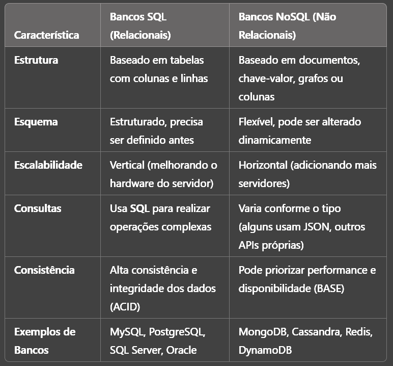
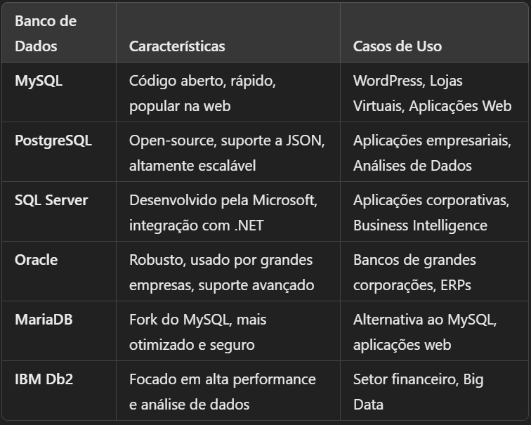

# Fundamentos do SQL

SQL (Structured Query Language) é uma linguagem de programação usada para gerenciar e manipular bancos de dados relacionais. Ela permite criar, ler, atualizar e excluir dados (CRUD), além de realizar consultas complexas para análise e geração de relatórios. Usamos SQL para:

- Consultar e filtrar dados de forma eficiente

- Criar e modificar estruturas de bancos de dados

- Gerenciar permissões e segurança de acesso

- Integrar sistemas que precisam armazenar e recuperar informações estruturadas.

---

Os principais termos e conceitos que você deve conhecer para começar a estudar SQL são: 

**Banco de Dados Relacional:** Estrutura que armazena dados organizados em tabelas interconectadas.

**Tabelas:** Conjuntos de dados organizados em colunas e linhas

**Colunas(atributos):** Representam os tipos de dados armazenados (ex: nome, idade)

**Linhas(Registros):** Cada entrada na tabela ou dados de uma coluna representa um registro.

**Chave Primária:** Identificador único para cada registro na tabela.

**Chave Estrangeira:** Relaciona dados entre tabelas diferentes.

**DDL (Data Definition Language):** Comandos para definir e modificar estrutura do banco(**CREATE**, **ALTER**, **DROP**).

**DML (Data Manipulation Language):** Comandos para manipular dados (**INSERT**, **UPDATE**, **DELETE**, **SELECT**)

**DCL(Data Control Language):** Gerenciamento de permissões(**GRANT**, **REVOKE**).

**TCL(Transaction Control Language):** Controle de transações(**COMMIT**, **ROLLBACK**)

## Exemplos

Aqui estão alguns exemplos básicos em SQL usando MySQL/PostgreSQL:

``` SQL

-- Criando uma tabela

CREATE TABLE usuarios (
    id SERIAL PRIMARY KEY,
    nom VARCHAR (100) NOT NULL,
    email VARCHAR (100) UNIQUE NOT NULL,
    idade INT
);


-- Inserindo dados

INSERT INTO usuarios (nome, email, idade) VALUES
('Alice', 'alice@gmail.com', 25),
('Bob', 'bob@gmail.com', 30);


-- Consultando dados

SELECT * FROM usuarios;


-- Filtrando Registros

SELECT nome, email FROM usuarios WHERE idade > 25


-- Atualizando Registros

UPDATE usuarios SET idade = 31 WHERE nome = 'Bob';


-- Removendo registros

DELETE FROM usuarios WHERE nome = 'Alice';

```

## Boa práticas

- Sempre defina chaves primárias e estrangeiras para manter a integridade dos dados.

- Use **VARCHAR** com tamanho adequado para otimizar armazenamento.

- Utilize índices (**INDEX**) para melhorar a performance de consultas em colunas muito pesquisadas.

- Utilize transações (**BEGIN TRANSACTION**, **COMMIT**, **ROLLBACK**) ao modificar dados importantes.

- Não use SELECT * em consultas grandes, prefira selecionar apenas as colunas necessárias.

- Cuidado ao usar DELETE sem WHERE, pois pode apagar todas as tabelas

- Evite redundância de dados e mantenha a normalização do banco.

# Diferença entre SQL e NoSQL

SQL e NoSQL são dois modelos de bancos de dados usados para armazenar e gerenciar informações, mas com abordagens diferentes:

**SQL (Bancos Relacionais):** usa tabelas estruturadas, com esquemas rígidos e relacionamentos bem definidos.

**NoSQL (Bancos não Relacionais):** é mais flexível, permitindo armazenar dados de maneira menos estruturada, sem a necessidade de esquemas fixos.



- ACID: ACID é um conjunto de propriedades que garantem a confiabilidade das transações em bancos de dados relacionais. O termo vem do inglês e representa: Atomicidade, Consistencia, Isolamento e Durabilidade.

- BASE: Basicamente Disponivel, Estado Suave, Eventuamente Consistente - Prioriza performance e flexibilidade no NoSQL.

## Exemplos

Criando e consultando um banco SQL tradicional

``` SQL

CREATE TABLE produtos (
    id SERIAL PRIMARY KEY,
    nome VARCHAR(100) NOT NULL,
    preco DECIMAL(10,2) NOT NULL
);

INSERT INTO produtos (nome, preco) VALUES ('Notebook', 2500.00);

SELECT nome, preco FROM produtos;

```

Agora vamos consultar um banco NoSQL (MongoDB - Banco de Documentos)

``` JSON

{
    "id": 1,
    "nome": "Notebook",
    "preco": 2500.00
}

``` 

``` JavaScript

db.produtos.insertOne({ nome: "Notebook", preco: 2500.00 });
db.produtos.find();

```

## Boas Práticas

- Use SQL quando precisar de dados altamente estruturados e relações complexas.

- Use NoSQL para dados dinâmicos, que mudam de estrutura com frequência.

- Entenda o tipo de escalabilidade necessário antes de escolher entre SQL e NoSQL.

- Em sistemas híbridos, pode-se usar SQL para dados transacionais e NoSQL para logs, cache e dados não estruturados.

# Tipos de Bancos de Dados Relacionais

Bancos de dados relacionais armazenam informações estruturadas em tabelas interconectadas. Cada tabela contém colunas (atributos) e linhas (registros), permitindo consultas eficientes e garantindo a integridade dos dados.

Esses bancos seguem o modelo relacional e utilizam SQL para manipulação de dados. Eles são ideais para sistemas que exigem alta confiabilidade, como ERPs(É um software que ajuda a gerir uma empresa de forma integrada e automatizada), CRMs(conjunto de práticas, estratégias de negócio e tecnologias focadas no relacionamento com o cliente) e aplicações financeiras.



- MySQL e MariaDB são leves e ideais para aplicações web.

- PostgreSQL é excelente para aplicações complexas e escaláveis.

- SQL Server e Oracle são voltados para grandes empresas e bancos de dados críticos.

# Instalação e Configuração de um SGBD (Sistema Gerenciador de Banco de Dados)

SGBD (Sistema Gerenciador de Banco de Dados) é um software responsável por armazenar, organizar e gerenciar dados de forma eficiente. Os dois mais populares são:

**MySQL:** Amplamente usado em aplicações web, como WordPress, e-commerce e sistemas empresariais.

**PosrgreSQL:** Mais robusto, ideal para sistemas que precisam de escalabilidade e manipulações complexas de dados.

## Instalação do PostgreSQL

1. Baixe o instalador no site oficial: [PostgreSQL Download](https://www.postgresql.org/download/)

2. Durante a instalação, escolha uma senha para o usuário postgres.

3. Instale a ferramenta pgAdmin para gerenciar o banco graficamente.

### Configuração Básica

Como primeira configuração a se realizar em um banco Postgre, precisamos fazer a criação de um usuário e um banco.

``` SQL

CREATE DATABASE loja;
CREATE USER usuario WHITH ENCRYPTED PASSWORD 'senha123';
GRANT ALL PRIVILEGES ON DATABASE loja TO usuario;

```

## Boas práticas

- Sempre defina senhas fortes para usuários administrativos.

- Restrinja acessos com privilégios mínimos necessários.

- Habilite backups automáticos para evitar perda de dados.

- Monitore o uso do banco para evitar gargalos de desempenho.

- Evite deixar o usuário **root** sem senha.

- Configure firewall e regras de acesso para evitar ataques