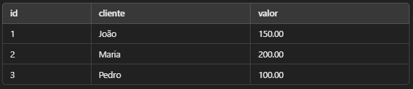

# Funções SQL

As funções SQL são comandos que realizam operações em dados armazenados no banco de dados, retornando valores calculados ou transformados. Elas ajudam a processar dados de maneira eficiente, sem precisar de programação adicional na aplicação.

As funções são categorizadas em 4 tipos:

**Funções de Agregação** -> Para calcular estatísticas em conjuntos de dados.

**Funções de Data e Hora** -> Para manipular e formatar datas e horários.

**Funções de String** -> Para modificar e formatar textos.

**Funções Matemáticas** -> Para cálculos e operações numéricas.

## Funções de Agregação

As funções de agregação trabalham sobre um conjunto de registros e retornam um único valor, como soma, média ou contagem.

**COUNT()** -> Conta o número de registros. 

**SUM()** -> Soma os valores de uma coluna numérica.

**AVG()** -> Calcula a média dos valores de uma coluna numérica.

**MIN()** -> Retorna o menor valor em uma coluna.

**MAX()** -> Retorna o maior valor em uma coluna.

Suponha que temos uma tabela vendas com os seguintes dados:



``` SQL

SELECT COUNT(*) AS total_vendas FROM vendas;

-- Retorna: 3


SELECT SUM(valor) total_receita FROM vendas;

-- Retorna 450.00


SELECT AVG(valor) AS media_vendas FROM vendas;

-- Retorna 150.00


SELECT MIN(valor) AS menor_venda FROM vendas;

-- Retorna 100.00


SELECT MAX(valor) AS maior_venda FROM vendas;

-- Retorna 200.00

```

## Funções de Data e Hora

As funções de data e hora são úteis para lidar com operações envolvendo datas.

**NOW()** -> Retorna a data e hora atuais do sistema.

**DATE_FORMAT(data, formato)** -> Formata uma data em um formato específico.

**DATEDIFF(data1, data2)** -> Calcula a diferença entre duas datas em dias.

``` SQL

SELECT NOW();

-- Retorna: 2025-02-25 14:30:00


SELECT DATE_FORMAT(NOW(), '%d%m%y') AS data_formatada;

-- Retorna: 25/02/2025


SELECT DATEDIFF('2025-03-01', '2025-02-25');

-- Retorna 4

```

## Funções de String

As funções de String permitem manipular texto dentro do SQL

**UPPER()** -> Converte uma String em maiúsculas.

**LOWER()** -> Converte uma String em minúsculas.

**CONCAT()** -> Concatena (junta) Strings

**SUBSTRING()** -> Extrai parte de uma String

``` SQL

SELECT UPPER('sql é incrível') AS maiusculo;
-- Retorna: SQL É INCRÍVEL

SELECT LOWER('SQL É PODEROSO') AS minusculo;
-- Retorna: sql é poderoso

SELECT CONCAT('Olá', ' ', 'Mundo') AS mensagem;
-- Retorna: Olá Mundo

SELECT SUBSTRING('Aprendendo SQL', 12, 3) AS trecho;
-- Retorna: SQL

```

## Funções Matemáticas

As funções matemáticas são usadas para cálculos numéricos em consultas SQL.

**ROUND()** -> Arredonda um número para um número específico de casas decimais.

**ABS()** -> Retorna o valor absoluto de um número.

**CEIL()** -> Arredonda um número para cima

**FLOOR()** -> Arredonda um numero para baixo.

``` SQL

SELECT ROUND(3.14159, 2) AS arredondado;
-- Retorna: 3.14

SELECT ABS(-15) AS absoluto;
-- Retorna: 15

SELECT CEIL(4.3) AS teto;
-- Retorna: 5

SELECT FLOOR(4.9) AS piso;
-- Retorna: 4

```

# Boas práticas

- Utilize funções de agregação com **GROUP BY** para obter estatísticas mais detalhadas.

- Prefira usar **DATE_FORMAT()** para formatar datas ao invés de manipular os dados no código da aplicação.

- Sempre valide os dados antes de aplicar funções matemáticas, evitando divisões por zero.